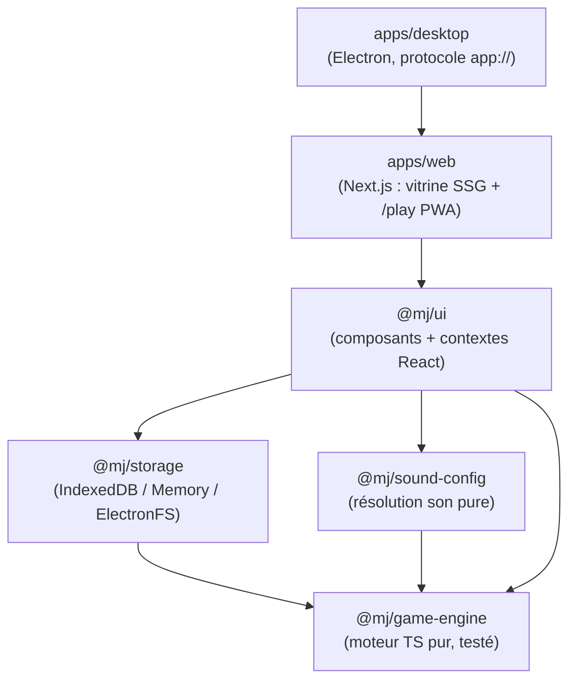

# 🐺 MJ App - Loup-Garou de Thiercelieux

Assistant **Maître du Jeu** pour le *Loup-Garou de Thiercelieux* : ordre des nuits, actions
des rôles, votes, conditions de victoire et sons d'ambiance. Fonctionne dans le navigateur
(PWA installable, jouable hors-ligne) et en application desktop (Windows, macOS, Linux).

4 à 25 joueurs · 22 rôles.

## Fonctionnalités

- **22 rôles** : Villageois, Loups-Garous, Sorcière, Voyante, Chasseur, Cupidon, Fossoyeur,
  Joueur de Flûte, Loup Blanc, Ancien, Salvateur, Corbeau, Renard, Chien-Loup, Voleur,
  Enfant Sauvage, Déménageur, Sœurs, Montreur d'Ours, Juge Bègue, Grand Méchant Loup, Idiot.
- **Phase nuit** : ordre automatique, actions par rôle (attaque, potions, révélations,
  transformations, cascades de morts).
- **Phase jour** : récap de l'aube, détection des victoires, vote et élimination.
- **Conditions de victoire** détectées automatiquement (Village, Loups, Amoureux, Flûte,
  Loup Blanc, Fossoyeur).
- **Sons d'ambiance** : bibliothèque audio importée, stockée en IndexedDB (gros fichiers).
- **Sauvegarde / reprise** de partie, historique, modes focused / dashboard.

## Architecture (monorepo Turborepo + pnpm)



Le moteur de jeu ne dépend de rien (réutilisable côté serveur pour un futur multijoueur).
Frontières vérifiées par `eslint-plugin-boundaries`.

```
mj/
  apps/
    web/        # Next.js App Router : (marketing) SSG + (app)/play client (PWA Serwist)
    desktop/    # Electron : main + preload + protocole app://
  packages/
    game-engine/   # @mj/game-engine : types, données, règles, reducer (Vitest)
    storage/       # @mj/storage : PersistencePort + adapters
    sound-config/  # @mj/sound-config : données son + résolution pure
    ui/            # @mj/ui : écrans de jeu + contextes (Game/Storage/Sound)
    tsconfig/      # presets TypeScript partagés
```

## Démarrage

Prérequis : Node 22+, pnpm 10+.

```bash
pnpm install
pnpm dev                          # serveur de dev Next.js (http://localhost:3000)
pnpm build                        # build web
pnpm build:desktop                # export statique pour Electron (BUILD_TARGET=desktop)
pnpm test                         # Vitest (moteur, storage, sound-config)
pnpm lint                         # ESLint + boundaries
pnpm typecheck                    # tsc sur tous les packages
```

La vitrine SEO est servie par les routes `(marketing)` (`/`, `/roles`, `/regles`,
`/a-propos`) ; le jeu vit sous `/play`.

## Stack technique

- **Monorepo** : Turborepo + pnpm (`node-linker=hoisted`).
- **Web** : Next.js (App Router), Tailwind CSS v4 (thème sombre rouge sang,
  Cinzel / Crimson Text / JetBrains Mono), PWA via Serwist.
- **Moteur** : TypeScript pur, sans dépendance React/DOM, testé (Vitest).
- **Persistance** : IndexedDB (web) / fichiers natifs (desktop) via un `PersistencePort`.
- **Desktop** : Electron, chargement de l'export statique via protocole custom `app://`.

## Versioning

SemVer. Version centralisée dans `apps/desktop/package.json` (source de vérité),
alignée vers `apps/web` par `pnpm sync-version`. Voir `CHANGELOG.md`.

## Licence

Voir `LICENSE`.
